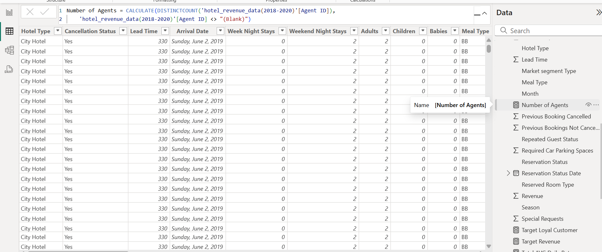
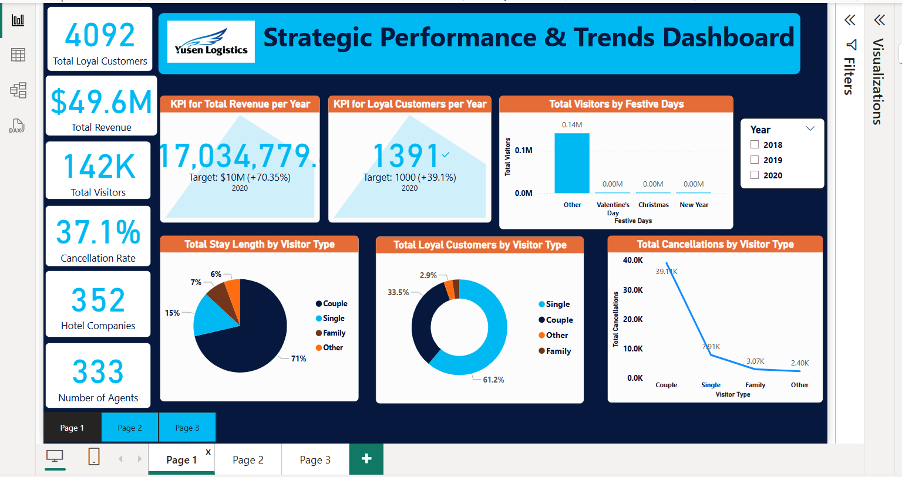

# Hotel-Revenue-Management-Analysis
As a hypothetical BI Insights Manager,  my job is to create a deep-dive analysis report in Power BI about the Hotel Revenue Management of a fictional company named "Yusen logistics".

---

---
## Introduction:

The Yusen Hotel Management analysis was prepared with Microsoft Excel and PowerBI. Time analysis exploration into reservation trends was performed including Seasonality, Festive periods, weekday vs weekend etc. Key insights into the performance of several Agents and overall hotel performance from set KPI were gained. Further insights on Customers type (family with children, single or couples visitors) were also obtained.

---
## Problem Statement:

The objectives of the analysis are:
- Perform Time analysis exploration into reservation trends.
- identify the top performing agents.
- use KPIs to measure the performance of the hotels with respect to the revenue generated.
- use the insights gained to make recommendations for optimization.

---
## Data Source:

The datasets used for this project was from a Microsoft Excel workbook provided by the Tech Instistute "DAHEL Techies" where I completed my internship. I studied the datasets alongside the data dictionary and figured out the approach to take for the analysis. 

Click [here](Dataset.xlsx) for Datasets. Also refer to [data dictionary](Dataset_dictionary.xlsx)

---
## Data Transformation:

1. Imported Excel workbook into Power Query Editor using the "Get Data" feature

2. Used Power Query Editor to clean and transform data as follows:
   - Promote headers
   - Append and Merge datasets from three separate tables to form one table
   - Create custom calculated columns

   - Delete columns, reorder columns, merge columns
   - Change data type for each column to correspond with the values
   - Replace "null" values
   - Filter rows
   - Use Column quality, Column distribution and/or Column profile to verify that data is 100% clean.
   - Import cleaned data from Power Query Editor into PowerBI desktop
3. Create measures in PowerBI to calculate hotel cancellation rate, total revenue, total loyal customers, etc for Data visualization.
4. Create key performance indicators (KPIs) and other business calculations,
5. Carry out DAX calculations for solving statistical measures and other mathematical formulas.

   
6. Data Modelling
7. Data Visualization using various tools:
   - Navigation panes
   - Cards, Clustered column chart, KPI, Slicer, Line chart, Donut chart, pie chart, Area chart, clustered bar chart
   - Filter
   - Text box

*Please Note: I have attached the file for my completed [PowerBI project](Power_BI_Project-Okonkwo-Chiamaka-I.pbix) for reference as I could not include all screenshots of my work*

---
## Data Modelling:

Due to the simplicity of the schema, one to many relationships were automatically created by PowerBI to produce a simplified data model which was found to be accurate upon inspection. The data model shows relationship between the tables in the schema which can be seen below.

One to Many Relationship between "Meal_cost" and "Hotel_revenue_data" tables

One to Many Relationship between "Market_segment_discount" and "Hotel_revenue_data" tables

---
## Data Analysis:

Several expressions and functions were used to get the Metrics used used to gauge the performance of the agents and hotels. 
They are:

To create a "Season" column: _if [Month] = "December" or [Month] = "January" or [Month] = "February" then "Winter"  
else if [Month] = "March" or [Month] = "April" or [Month] = "May" then "Spring"  
else if [Month] = "June" or [Month] = "July" or [Month] = "August" then "Summer"
else "Autumn"_

To create a "Visitor Type" column: _if [Adults] = 1 then "Single"  
else if [Adults] = 2 and [Children] = 0 and [Babies] = 0 then "Couple"  
else if [Adults] = 2 and ([Children] > 0 or [Babies] > 0) then "Family"  
else null_

To create a "Festive Days" column:
_= Table.AddColumn(#"Reordered Columns2", "Festive Days", each if Date.Month([Arrival Date]) = 12   
and Date.Day([Arrival Date]) = 25 then "Christmas"  
else if Date.Month([Arrival Date]) = 1   
and Date.Day([Arrival Date]) = 1 then "New Year"  
else if Date.Month([Arrival Date]) = 2   
and Date.Day([Arrival Date]) = 14 then "Valentine's Day"  
else "Other")_

To create a "Revenue" column: = ([Week Night Stays] * [AVG Daily Rate]) +   
([Weekend Night Stays] * [AVG Daily Rate])

Cancellation Rate *= DIVIDE([Total Cancellations], [Total Bookings], 0)*

Hotel Companies *= CALCULATE(DISTINCTCOUNT('hotel_revenue_data(2018-2020)'[Company ID]),  
    'hotel_revenue_data(2018-2020)'[Company ID] <> "NULL")*

Number of Agents *= CALCULATE(DISTINCTCOUNT('hotel_revenue_data(2018-2020)'[Agent ID]),  
    'hotel_revenue_data(2018-2020)'[Agent ID] <> "(Blank)")*

Total AVG Daily Rate *= SUM('hotel_revenue_data(2018-2020)'[AVG Daily Rate])*

Total Bookings *= COUNTROWS('hotel_revenue_data(2018-2020)')*

Average AVG Daily Rate *= [Total AVG Daily Rate]/[Total Bookings]*

Total Cancellations *= COUNTROWS(FILTER('hotel_revenue_data(2018-2020)', 'hotel_revenue_data(2018-2020)'[Cancellation Status] =  "Yes"))*

Total Loyal Customers *= COUNTROWS(FILTER('hotel_revenue_data(2018-2020)', 'hotel_revenue_data(2018-2020)'[Repeated Guest Status] = "Yes"))*

Total Revenue *= SUM('hotel_revenue_data(2018-2020)'[Revenue])*

Total Stay Length *= SUM('hotel_revenue_data(2018-2020)'[Week Night Stays]) + SUM('hotel_revenue_data(2018-2020)'[Weekend Night Stays])*

Total Visitors *= COUNTROWS(FILTER('hotel_revenue_data(2018-2020)', 'hotel_revenue_data(2018-2020)'[Visitor Type] <> "Others"))*
    
Weekend_night stays *= SUM('hotel_revenue_data(2018-2020)'[Weekend Night Stays])*

Weeknight stays *= SUM('hotel_revenue_data(2018-2020)'[Week Night Stays])*

__NB__ : All the formlulas for the Measures and measures can not be well explained by just writing the expressions here as they are written on various tables. 
The expressions written above for the calculated columns and measures can not be well explained here. Please view PowerBI file attached [here](Power_BI_Project-Okonkwo-Chiamaka-I.pbix) on PowerBI desktop or online for better understanding.

---
## Data Visualization

On the Report view, a Strategic Performance & Trends Dashboard was created consisting of three pages.   

### Features of the Report

- **Navigation panes** added to enhance user experience.
- **Cards Visuals** show Total Loyal Customers, Total Revenue, Total Hotel visitors, Average AVG Daily Rate, Cancellation Rate, No. of Hotel Companies and No. of Agents
- **KPIs**: Compares the Total Revenue per Year with $10 miilion target and Loyal Customers per Year with target of 1,000
- **Clustered column charts** used to depict Total Visistors during Festive Days and Top Performing Agents by Revenue
- **Clustered bar charts** showing Total Loyal Customers by each Agent and Total Hotel Stay Length by Year/Season
- **Line charts** displays the Least Performing Agents by Total Hotel Cancellations and Total Cancellations by each Visitor Type
- **Slicers**: to filter the results shown on the visuals by Year or Hotel Type
- **Donut chart**: Shows the Total Loyal Customers classified by each Visitor Type
- **Pie charts**: Measures the Total Stay Length by Visitor Type. Piechart 2 makes comparison between the stay length during Week Nights vs Weekend Nights
- **Area chart**: Indicates the Total Revenue Made by Each Company
- **Filter**: Applied to Page 1 of the report. Filters the information on the page by the Agent ID
- **Text box**: Used to create the Dashboard Title and also the Assumptions made on Page 3 of the report.

---
## Key Metrics and Findings

### Hotel Reservation Analysis
__Total Visitors__:
* 141,585 bookings were recorded between 2018 and 2020.
   * 2018: 21,815
   * 2019: 79,083
   * 2020: 40,687

__Loyal Customers__:
* The total number of loyal customers are 4092 with the highest number recorded in 2019 being 2240, surpassing the yearly target of 1,000.  
* Among the Loyal Customers, Singles were the highest at 61% of total bookings. Note that loyal customers is an alias for repeated guests. 

__Total Stay Length by Visitor Type__:  
* Visitors who were couples had the longest stays at the hotels with a record 71%

__Total Cancellation by Visitor Type__:  
* Couples had the most cancellations in comparison with other visitor types with numbers as high as 39,109

__Total Visitors by Festive days__:  
* From the analysis, it was evident that the hotels had frequent bookings during non-festive periods i.e. outside of Christmas, new year and valentine’s day

__Total Stay Length by Year and Season__:  
* Seasonal trends show increase in hotel stays during autumn season between 2018 and 2019, with a surge during spring and summer for the year 2020.

__Week Stays vs. Weekend Stays__:  
* The hotel had more visitors during the weekend nights than on week nights.

__Cancellation Rate__: 
* Total cancellation was recorded at a rate of 37.1% for the period of 2018 to 2020

### Revenue Analysis  
__Total Revenue__:
* Revenue generated over three year from 2018 to 2020 was $49.62 million. The yearly breakdown outlined below:
  * 2018: $6.79 million
  * 2019: $25.80 million
  * 2020: $17.03 million
* Using the KPI for Total Revenue per year, it is clearly seen that the yearly target of $10 million was not met in 2018.

__Average Daily Rate (ADR)__:
* The ADR across the specified period was $99.51.

__Agents Performance__:
* The best performing agent was Agent ID 9, making the most revenue of $13,488,000 across three years.
* Agent ID 240 had the most loyal customers recorded at 274 customer within the specific period of 2018 to 2019
* The least performing Agent had customers with the most cancellations of 13,891 signifying a loss in revenue

__Total Revenue Made by Each Company__:
* The company with Company ID 223 had the biggest revenue through the years with an estimate of $206,115.
* The least revenue was made by Company ID 174 calculated as $35,491

Find below screenshots of the Analysis report:  

**<ins>Page 1</ins>**

**<ins>Page 2</ins>**

**<ins>Page 3</ins>**

---
## Insights and Recommendation

1.	Revenue generation by Agents:
	* With considerable revenue brought in by agents, it will be beneficial to create reward programs for top performing agents to act as an incentive that could boost performance of other agents
2.	Loyal Customers as Key Revenue Drivers:
	* Loyal customers contribute to the majority of both bookings and revenue.
	*Recommendation: Loyalty programs and promotional offers tailored to retain and attract more loyal customers should be considered.
3.	Festive Peaks in Reservations:
	* Reservations peak during non-festive periods.
	* Recommendation: Capitalize on high-demand months by implementing increased pricing and advertising campaigns.
4.	Week-days vs. Weekend Trends:
	* Since hotel bookings for weekends are significantly higher than on week nights, introduce week day offers and packages to attract more customers during the week.
5.	Cancellation Management:
	* Frequent cancellations by visitors that are couples pose risk of revenue reduction over time.
	* Recommendation: Review cancellation policies to reduce revenue loss, such as stricter terms of agreement or good incentives for non-refundable bookings.

---
## Conclusion

The Strategic Performance and Trends Dashboard for Yusen Logistics highlights critical metrics and trends in hotel management. By leveraging insights on customer behavior, agents' performance, seasonal and festive trends and ADR patterns, the hotels can improve their operational efficiency, boost revenue generation, and enhance customer satisfaction.

