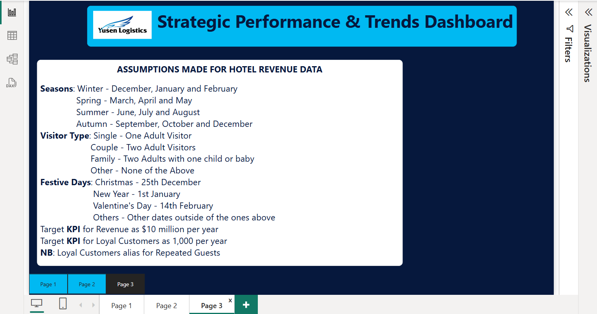

# Hotel-Revenue-Management-Analysis
As a hypothetical BI Insights Manager,  my job is to create a deep-dive analysis report in Power BI about the Hotel Revenue Management of a fictional company named "Yusen logistics".

---

---
## Introduction:

The Yusen Hotel Management analysis was prepared with Microsoft Excel and PowerBI. Time analysis exploration into reservation trends was performed including Seasonality, Festive periods, weekday vs weekend etc. Key insights into the performance of several Agents and overall hotel performance from set KPI were gained. Further insights on Customers type (family with children, single or couples visitors) were also obtained.

---
## Problem Statement:

The objectives of the analysis are:
- Perform Time analysis exploration into reservation trends.
- identify the top performing agents.
- use KPIs to measure the performance of the hotels with respect to the revenue generated.
- use the insights gained to make recommendations for optimization.

---
## Data Source:

The datasets used for this project was from a Microsoft Excel workbook provided by the Tech Instistute "DAHEL Techies" where I completed my internship. I studied the datasets alongside the data dictionary and figured out the approach to take for the analysis. 

Click [here](Dataset.xlsx) for Datasets. Also refer to [data dictionary](Dataset_dictionary.xlsx)

---
## Data Transformation:

1. Imported Excel workbook into Power Query Editor using the "Get Data" feature

2. Used Power Query Editor to clean and transform data as follows:
   - Promote headers
   - Append and Merge datasets from three separate tables to form one table
   - Create new columns, delete columns, reorder columns, merge columns
   - Change data type for each column to correspond with the values
   - Replace "null" values
   - Filter rows
   - Use Column quality, Column distribution and/or Column profile to verify that data is 100% clean.
   - Import cleaned data from Power Query Editor into PowerBI desktop
3. Create measures in PowerBI to calculate hotel cancellation rate, total revenue, total loyal customers, etc for Data visualization.
4. Create key performance indicators (KPIs) and other business calculations,
5. Carry out DAX calculations for solving statistical measures and other mathematical formulas.

   
6. Data Modelling
7. Data Visualization using various tools:
   - Navigation panes
   - Cards, Clustered column chart, KPI, Slicer, Line chart, Donut chart, pie chart, Area chart, clustered bar chart
   - Filter
   - Text box

*Please Note: I have attached the file for my completed [PowerBI project](PowerBI_Project-Okonkwo-Chiamaka-I.pbix) for reference as I could not include all screenshots of my work*

---
## Data Modelling:

Due to the simplicity of the schema, one to many relationships were automatically created by PowerBI to produce a simplified data model which was found to be accurate upon inspection. The data model shows relationship between the tables in the schema which can be seen below.

One to Many Relationship between "Meal_cost" and "Hotel_revenue_data" tables

One to Many Relationship between "Market_segment_discount" and "Hotel_revenue_data" tables

---
## Data Analysis:

Several expressions and functions were used to get the Metrics used used to gauge the performance of the agents and hotels. 
They are:

To create a "Season" column: _if [Month] = "December" or [Month] = "January" or [Month] = "February" then "Winter"  
else if [Month] = "March" or [Month] = "April" or [Month] = "May" then "Spring"  
else if [Month] = "June" or [Month] = "July" or [Month] = "August" then "Summer"
else "Autumn"_

To create a "Visitor Type" column: _if [Adults] = 1 then "Single"  
else if [Adults] = 2 and [Children] = 0 and [Babies] = 0 then "Couple"  
else if [Adults] = 2 and ([Children] > 0 or [Babies] > 0) then "Family"  
else null_

To create a "Festive Days" column:
_= Table.AddColumn(#"Reordered Columns2", "Festive Days", each if Date.Month([Arrival Date]) = 12   
and Date.Day([Arrival Date]) = 25 then "Christmas"  
else if Date.Month([Arrival Date]) = 1   
and Date.Day([Arrival Date]) = 1 then "New Year"  
else if Date.Month([Arrival Date]) = 2   
and Date.Day([Arrival Date]) = 14 then "Valentine's Day"  
else "Other")_

Cancellation Rate *= DIVIDE([Total Cancellations], [Total Bookings], 0)*

Hotel Companies *= CALCULATE(DISTINCTCOUNT('hotel_revenue_data(2018-2020)'[Company ID]),  
    'hotel_revenue_data(2018-2020)'[Company ID] <> "NULL")*

Number of Agents *= CALCULATE(DISTINCTCOUNT('hotel_revenue_data(2018-2020)'[Agent ID]),  
    'hotel_revenue_data(2018-2020)'[Agent ID] <> "(Blank)")*

Total AVG Daily Rate *= SUM('hotel_revenue_data(2018-2020)'[AVG Daily Rate])*

Total Cancellations *= COUNTROWS(FILTER('hotel_revenue_data(2018-2020)', 'hotel_revenue_data(2018-2020)'[Cancellation Status] =  "Yes"))*

Total Loyal Customers *= COUNTROWS(FILTER('hotel_revenue_data(2018-2020)', 'hotel_revenue_data(2018-2020)'[Repeated Guest Status] = "Yes"))*

Total Revenue *= SUMX('hotel_revenue_data(2018-2020)', ('hotel_revenue_data(2018-2020)'[Week Night Stays] + 'hotel_revenue_data(2018-2020)'[Weekend Night Stays])) *  
 SUMX('hotel_revenue_data(2018-2020)', 'hotel_revenue_data(2018-2020)'[AVG Daily Rate])*

Total Stay Length *= SUM('hotel_revenue_data(2018-2020)'[Week Night Stays]) + SUM('hotel_revenue_data(2018-2020)'[Weekend Night Stays])*

Total Visitors *= COUNTROWS(FILTER('hotel_revenue_data(2018-2020)', 'hotel_revenue_data(2018-2020)'[Visitor Type] <> "Others"))*
    
Weekend_night stays *= SUM('hotel_revenue_data(2018-2020)'[Weekend Night Stays])*

Weeknight stays *= SUM('hotel_revenue_data(2018-2020)'[Week Night Stays])*

All the formlulas for the Measures and measures can not be well explained by just writing the expressions here as they are written on various tables. 
The expressions written above for the calculated columns and measures can not be well explained here. Please view PowerBI file attached [here](PowerBI_Project-Okonkwo-Chiamaka-I.pbix) on PowerBI desktop or online for better understanding.

---
## Data Visualization

On the Report view, a Strategic Performance & Trends Dashboard was created consisting of three pages.   

### Features of the Report

- **Navigation panes** added to enhance user experience.
- **Cards Visuals** used to show Total Loyal Customers, Total Revenue, Total Hotel visitors, Cancellation Rate, No. of Hotel Companies and No. of Agents
- **KPIs**: Compares the Total Revenue per Year with $500bn target and Loyal Customers per Year with target of 1,000
- **Clustered column charts** used to depict Total Visistors during Festive Days and Top Performing Agents by Revenue
- **Clustered bar charts** showing Total Loyal Customers by each Agent and Total Hotel Stay Length by Year/Season
- **Line charts** displays the Least Performing Agents by Total Hotel Cancellations and Total Cancellations by each Visitor Type
- **Slicers**: to filter the results shown on the visuals by Year or Hotel Type
- **Donut chart**: Shows the Total Loyal Customers classified by each Visitor Type
- **Pie charts**: Measures the Total Stay Length by Visitor Type. Piechart 2 makes comparison between the stay length during Week Nights vs Weekend Nights
- **Area chart**: Indicates the Total Revenue Made by Each Company
- **Filter**: Applied to Page 1 of the report. Filters the information on the page by the Agent ID
- **Text box**: Used to create the Dashboard Title and also the Assumptions made on Page 3 of the report.

---
## Key Metrics and Findings

Find below screenshots of the report:  
**<ins>Page 1</ins>**

**<ins>Page 2</ins>**

**<ins>Page 3</ins>**

---
## Insights and Recommendation

The Company has 14 location for production/storage
There are 4 main categories of products (Bikes, Accessories, Clothing and Components)
The value of goods in the warehouse is about 74 billion USD
Bike sales has the highest impact on Inventory and Sales followed by Accessories.
There is a 42% Stock turn ratio
On time Production is 48%
93% of the entire products needs to be replaced for sales.

---
## Conclusion

